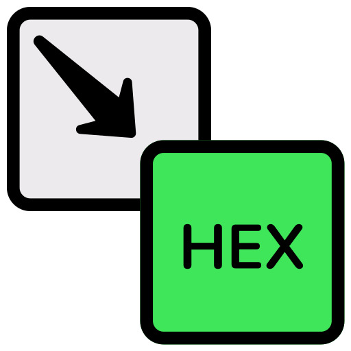

<h1>Memoria de FUNDAMENTOS-DE-JS-ES6-_CJ  - 2º DAW</h1>

<h2>Plantilla03 - 01</h2>

<h2>Índice</h2>
<ul>
  <li><a href="#introduccion">Introducción</a></li>
  <li><a href="#resumen">Resumen</a></li>
  <li><a href="#estructura">Estructura</a></li>
  <li><a href="#estilo">Estilo</a></li>
  <li><a href="#calculadora">Calculadora</a></li>
  <li><a href="#conversor">Conversor</a></li>
  <li><a href="#string">String</a></li>
  <li><a href="#string-api">String - API</a></li>
  <li><a href="#matriz">Matriz</a></li>
  <li><a href="#crud">Crud</a></li>
  <li><a href="#poo">Estructura</a></li>
</ul>

<h2 id="introduccion">Introducción</h2>

Trabajo realizado por: Sergio Ramos Alarcón

Proyecto de web de FUNDAMENTOS-DE-JS-ES6

Noviembre de 2024

Licencia CC-BY

<h2 id="resumen">Resumen</h2>

He añadido un header con mi nombre y el título de los ejercicios.

Posteriormente, he hecho una barra de navegación con herramientas y la colección de ejercicios.

En el body he añadido el ejercicio correspondiente de la plantilla 3.

He incorporado una funcionalidad de inicio de sesión mediante ventanas emergentes.

Se ha añadido una calculadora con operaciones básicas, funciones para obtener el número entero o decimal del resultado y el cálculo de factorial.

También he añadido un conversor de sistemas numéricos (octal, hexadecimal, etc.) en JavaScript.

Finalmente, he creado un nuevo `index.html` para hacer un redireccionamiento inicial y he organizado todo el proyecto en carpetas específicas.

Además, he sustituido el sistema de cookies por uno basado en <code>sessionStorage</code> para gestionar las sesiones de usuario.

También se ha añadido un apartado en el navbar llamado "String", donde se puede modificar un texto según las opciones solicitadas.

<h2 id="estructura">Estructura</h2>

La web está dividida en 4 secciones principales:

<ul>
  <li>Header</li>  
  <li>Navbar</li>
  <li>Body</li>
  <li>Formulario</li>
  <li>Footer</li>
</ul>

La estructura del proyecto se ha organizado de la siguiente manera, con cada funcionalidad o página separada en su propia carpeta:

<ul>
  <li>`/api`: Archivo HTML para la funcionalidad "API"</li>
  <li>`/assets`: Directorio con funcionalidades </li>
  <li>`/fonts`: Directorio con tipografías </li>
  <li>`/calculadora`: Archivo HTML para la calculadora</li>
  <li>`/classes`: Directorio JS para las clases</li>
  <li>`/components`: Directorio con componentes JS</li>
  <li>`/conversor`: Archivo HTML para el conversor</li>
  <li>`/crud`: Archivo HTML para el crud</li>
  <li>`/css`: Archivo CSS para los estilos</li>
  <li>`/js`: Archivos JavaScript</li>
  <li>`/img`: Imágenes</li>
  <li>`/login`: Archivo HTML para hacer el redirect después de iniciar sesión</li>
  <li>`/string`: Archivo HTML para la funcionalidad "String"</li>
  <li>`/api`: Archivo HTML para la funcionalidad "String - API"</li>
  <li>`/matriz`: Archivo HTML para la funcionalidad "Matriz"</li>
  <li>`/modulos`: Archivo JS para la funcionalidad de "Estructura"</li>
  <li>`/utils`: Directorio que contiene ficheros JavaScript </li>
</ul>

Se ha añadido un nuevo en `/login` -> `index.html` que redirecciona a la página principal de la web tras el login.

<h2 id="calculadora">Calculadora</h2>

He creado una calculadora en JavaScript que permite realizar las siguientes operaciones:

<ul>
  <li>Suma</li>
  <li>Resta</li>
  <li>Multiplicación</li>
  <li>División</li>
  <li>Factorial</li>
</ul>

Además, la calculadora cuenta con las siguientes funcionalidades adicionales:

<ul>
  <li>Obtener el número entero del resultado.</li>
  <li>Obtener el número decimal del resultado (si lo hubiera).</li>
</ul>

La calculadora está disponible en el navbar y se puede acceder a ella después de iniciar sesión. El archivo HTML de la calculadora está en la carpeta `/calculadora`.

<h2 id="conversor">Conversor</h2>

He añadido un conversor de sistemas numéricos que permite convertir entre los siguientes sistemas:

<ul>
  <li>Binario</li>
  <li>Octal</li>
  <li>Decimal</li>
  <li>Hexadecimal</li>
</ul>

El conversor facilita la conversión entre estos diferentes sistemas de numeración y está disponible en el navbar después de iniciar sesión. El archivo HTML del conversor está en la carpeta `/conversor`.

<h2 id="string">String</h2>

He añadido un apartado en el navbar llamado "String" que permite modificar un texto ingresado por el usuario. Estas modificaciones incluyen opciones como convertir a mayúsculas, minúsculas, eliminar espacios, entre otras funcionalidades, usando JavaScript.

El archivo HTML para esta funcionalidad está en la carpeta `/string`.

<h2 id="string-api">String - API</h2>

En este apartado, he implementado una conexión a la API de Star Wars, que permite acceder a información de personajes de esta saga. A través de JavaScript, se realiza una solicitud a la API, y la información de los personajes (nombre, género, especie, etc.) se muestra dinámicamente en la web. Esto permite explorar detalles de cada personaje de Star Wars en la interfaz de la aplicación.

El archivo HTML para esta funcionalidad se encuentra en la carpeta `/api`.

<h2 id="matriz">Matriz</h2>

He añadido una funcionalidad de operaciones con matrices, disponible en la sección "Matriz". Esta herramienta permite realizar operaciones matemáticas con matrices de dimensiones especificadas por el usuario, tales como suma, resta y multiplicación de matrices. La implementación permite seleccionar el tamaño de las matrices y realizar los cálculos según los valores ingresados.

El archivo HTML para esta funcionalidad está en la carpeta `/matriz`.

<h2 id="crud">Crud</h2>

Este apartado incluye funcionalidades relacionadas con el manejo de almacenamiento en el navegador, permitiendo gestionar datos mediante diferentes tecnologías de almacenamiento. A continuación se detallan las subramas:

<ul>
  <li><a href="#cookies">Cookies</a></li>
  <li><a href="#sessionstorage">SessionStorage</a></li>
  <li><a href="#loginstorage">LoginStorage</a></li>
  <li><a href="#indexeddb">IndexedDB</a></li>
</ul>

<h3 id="cookies">Cookies</h3>

En esta sección, se gestionan las cookies para almacenar datos persistentes entre sesiones. Las cookies permiten guardar información, como el estado de la sesión del usuario o preferencias de la página. Además, se puede realizar una petición a una API y almacenar los datos obtenidos en las cookies para su uso posterior.

<h3 id="sessionstorage">SessionStorage</h3>

El uso de <code>sessionStorage</code> permite almacenar datos que sólo persisten durante la sesión de navegación. Esta técnica se utiliza para almacenar información temporal, como el estado de la sesión del usuario. Los datos obtenidos de la API pueden ser almacenados temporalmente en <code>sessionStorage</code>, y se pueden recuperar mientras dure la sesión activa.

<h3 id="loginstorage">LoginStorage</h3>

El sistema de login utiliza almacenamiento en el navegador para gestionar la autenticación. Los datos relacionados con el inicio de sesión, como el estado de autenticación y las credenciales, se almacenan temporalmente para facilitar el acceso durante la sesión activa. Además, se pueden almacenar datos de usuario obtenidos de una API en este método de almacenamiento.

<h3 id="indexeddb">IndexedDB</h3>

IndexedDB es una base de datos en el navegador que permite almacenar grandes cantidades de datos de manera estructurada. En este apartado, se gestionan datos complejos que no son adecuados para cookies o <code>sessionStorage</code>. También se pueden almacenar datos obtenidos de una API para su consulta o modificación posterior.

<h3 id="estructura">Nuevo apartado: Estructura</h3>

He añadido un módulo en JavaScript con funcionalidades para gestionar estructuras de datos dinámicas. Estas estructuras permiten insertar, eliminar y gestionar datos de forma organizada.

Las estructuras implementadas son las siguientes:

<ul>
  <li><strong>Pila:</strong> Una estructura de tipo LIFO (Last In, First Out), donde el último elemento insertado es el primero en salir. Esta funcionalidad permite gestionar datos con métodos como <code>push</code> (insertar) y <code>pop</code> (eliminar).</li>
  <li><strong>Cola:</strong> Una estructura de tipo FIFO (First In, First Out), donde el primer elemento insertado es el primero en salir. La cola cuenta con métodos como <code>enqueue</code> (insertar) y <code>dequeue</code> (eliminar).</li>
  <li><strong>Lista:</strong> Una estructura más flexible que permite insertar y eliminar elementos en cualquier posición. La lista está diseñada para ser modular y puede gestionar una cantidad dinámica de datos.</li>
</ul>

<h2>Header</h2>

La cabecera incluye el título del temario de JavaScript.

También tiene todos los enlaces de js, favicon, css que necesito

<h2>Navbar</h2>

En el navbar he añadido los enlaces a la Plantilla 3, la Calculadora, el Conversor, el apartado "String", y el nuevo apartado "Crud", los cuales solo son visibles después de iniciar sesión.

<h2>Body</h2>

En el body he añadido el contenido de los ejercicios.

<h2>Formulario</h2>

El login se realiza mediante un formulario gestionado con JavaScript y utiliza <code>sessionStorage</code> en lugar de cookies para la gestión de la sesión de usuario.

<h2>Footer</h2>
<h4>Menú vertical central</h4>

He incluido mi nombre con copyright para los derechos de autor.

<h2 id="estilo">Estilo de la página</h2>
<h3>Paleta de colores (TODAVÍA NO ESTÁN TODOS USADOS)</h3>

  <li>#FFE66D</li>
  <li>#FF6B6B</li>
  <li>#F7FFF7</li>
  <li>#4ECDC4</li>
  <li>#1A535C</li>
  <li>black</li>
  <li>white</li> 

<h3>Tipografías</h3>

  <li>Roboto (Google)</li>
  <li>Helvetica</li>
  <li>Arial</li>
  <li>sans-serif</li>

<h2>Imágenes del proyecto</h2>

  
  
  
  

<h2>Videos</h2>

(Ninguno por ahora)

<h2 id="snippets">Code snippets</h2>

He utilizado los siguientes snippets:

<ul>
  
<a href="https://fonts.googleapis.com/css2?family=Roboto:wght@400;700&display=swap" rel="stylesheet">Enlace</a>

  
<a href="https://www.w3schools.com/howto/howto_css_dropdown.asp">Enlace</a>

</ul>
